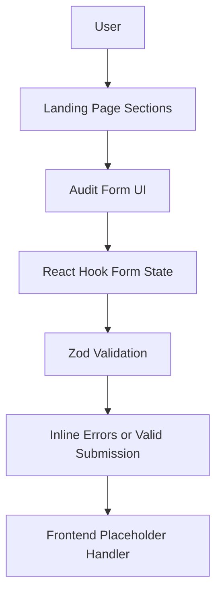

# Architecture Overview (Day 1)

## High-Level App Structure

This project is currently a frontend-first Next.js App Router application focused on landing page UX and validated form input capture.  
The codebase is organized around reusable UI primitives and section-level components to keep feature growth straightforward.

## Main Folders

- `app/`: routing entry points, root layout, and global styles
- `components/layout/`: cross-page layout pieces like navbar/footer
- `components/sections/`: landing page sections (hero, benefits, how-it-works, audit)
- `components/forms/`: form-specific UI composition
- `components/ui/`: reusable, shadcn-style design system primitives
- `lib/validations/`: Zod schemas and form typing
- `types/`: shared domain-oriented TypeScript types

## Basic Data Flow (Current)

1. User navigates landing page sections via anchor links.
2. User enters spend details into the audit form.
3. React Hook Form manages client-side form state.
4. Zod validates values and surfaces inline UI errors.
5. Submission currently stops at frontend placeholder handling (no backend integration yet).

## Why This Stack

- **Next.js 15**: App Router, strong DX, and production-ready rendering model.
- **TypeScript**: safer refactors and predictable form/schema contracts.
- **Tailwind CSS**: fast, consistent design iteration with utility-first styling.
- **shadcn/ui patterns**: composable, maintainable primitives aligned with startup-grade UI systems.

## Diagram

