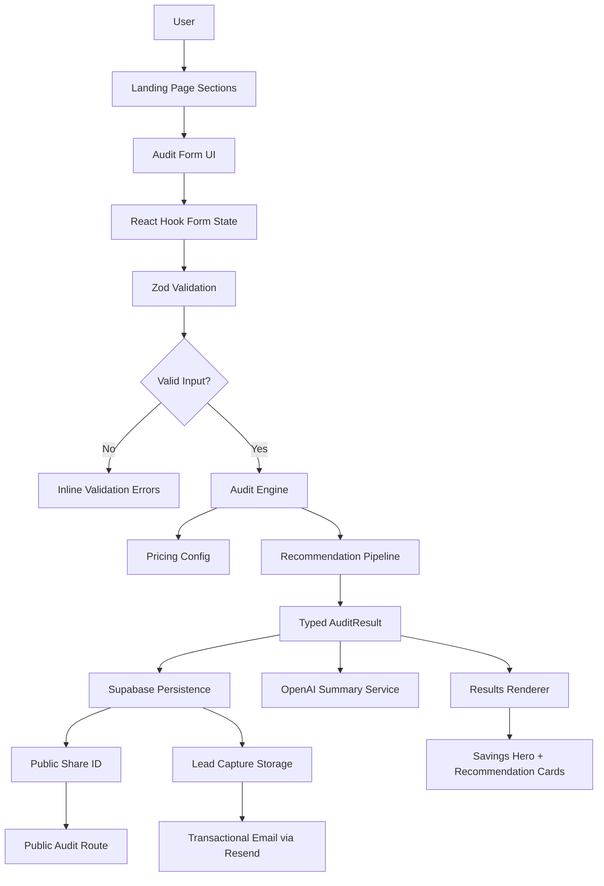

# Architecture Overview (Day 4)

## High-Level App Structure

This project is currently a full-stack Next.js App Router application focused on AI spend optimization for startups.
The application combines a frontend-first SaaS experience with a modular recommendation engine, lightweight backend persistence, AI-generated summaries, and shareable audit workflows.

The codebase is organized around reusable UI primitives, typed domain models, isolated service layers, and modular business logic to keep feature growth manageable and maintainable.

## Main Folders

* `app/`: routing entry points, root layout, dynamic audit routes, and global styles
* `components/layout/`: cross-page layout pieces like navbar/footer
* `components/sections/`: landing page sections (hero, benefits, how-it-works, audit)
* `components/forms/`: form-specific UI composition and lead capture flows
* `components/audit/`: savings and recommendation result rendering
* `components/ui/`: reusable, shadcn-style design system primitives
* `lib/validations/`: Zod schemas and form typing
* `lib/pricing.ts`: centralized pricing plans and tool metadata
* `lib/audit-engine.ts`: recommendation pipeline and savings calculations
* `services/supabase.ts`: database persistence helpers and client initialization
* `services/openai.ts`: AI-generated audit summary generation
* `services/resend.ts`: transactional email workflow
* `types/`: shared domain-oriented TypeScript types

## Audit Engine Data Flow

1. User navigates landing page sections via anchor links.
2. User enters spend details into the audit form.
3. React Hook Form manages client-side form state.
4. Zod validates values and surfaces inline UI errors.
5. Valid form input is passed to `generateAuditResult(...)`.
6. Pricing and plan info are resolved from `lib/pricing.ts`.
7. Recommendation pipeline evaluates downgrade, alternative, and optimization opportunities.
8. Engine returns a typed `AuditResult` with:

   * monthly savings
   * annual savings
   * confidence scoring
   * recommendation reasoning
9. Results renderer components display summary and recommendation cards.
10. OpenAI generates a concise personalized audit summary.
11. Lead capture information is optionally collected.
12. Audit + lead data are persisted to Supabase.
13. A public shareable audit URL is generated.
14. Resend sends a transactional confirmation email.

## Pricing Configuration

`lib/pricing.ts` acts as the source of truth for cost assumptions:

* Tool catalog (Cursor, Copilot, Claude, ChatGPT, Gemini, Windsurf/v0)
* Plan-level monthly pricing and seat pricing
* Lightweight metadata for recommendation context
* Normalization helpers for tool aliases and plan resolution

Keeping pricing separate from recommendation logic makes rule tuning easier and keeps calculations deterministic.

## Recommendation Pipeline

`lib/audit-engine.ts` applies a small, ordered pipeline:

1. **Downgrade rules:** flags over-provisioned plans for small seat counts.
2. **Alternative rules:** for larger teams, proposes blended stack options with lower modeled spend.
3. **Optimization fallback:** suggests the most efficient available seat-level plan when appropriate.
4. **Savings aggregation:** computes total monthly and annual savings.
5. **Confidence scoring:** estimates recommendation reliability based on pricing and seat assumptions.

## Recommendation Safety Constraints

The engine now applies explicit safety rules to improve trust:

- Normalize invalid/edge numeric inputs (seat count, team size, spend) to safe minimums.
- Suppress aggressive recommendations for low-spend anomalies (very low spend per seat).
- Cap recommendation savings with a maximum savings ratio to avoid unrealistic outputs.
- Avoid overcounting by realizing one recommendation path in summary totals while still listing alternatives.
- Provide fallback "no urgent action" messaging when no meaningful savings are available.

These constraints live in `lib/audit-engine.ts` and are unit tested.

## Testing Strategy

Current tests focus on deterministic core logic:

- `tests/audit-engine.test.ts`
  - savings math
  - downgrade and alternative recommendation gates
  - confidence range checks
  - zero-seat defensive handling
  - low-spend anomaly suppression
- `tests/pricing.test.ts`
  - alias/plan resolution
  - pricing estimate helpers
  - pricing catalog sanity checks

The strategy intentionally prioritizes confidence in business-critical calculations over UI snapshot coverage.

## CI Pipeline

GitHub Actions workflow (`.github/workflows/ci.yml`) runs on push to `main`:

1. install dependencies via `npm ci`
2. run lint (`npm run lint`)
3. run strict TypeScript checks (`npm run typecheck`)
4. run tests (`npm run test`)

This keeps MVP quality gates lightweight while preventing regressions in recommendation logic.

## Validation Flow

Validation is layered:

1. Form-level validation with Zod (`lib/validations/audit-form.ts`).
2. Type-level validation via strict TypeScript contracts (`types/` + strict compiler settings).
3. Rule-level validation through unit tests around deterministic recommendation logic.
4. Runtime fallback handling in external services (`services/openai.ts`, `services/resend.ts`) to avoid broken user flow during provider issues.

## Abuse Protection Notes (MVP)

Chosen approach:

- Use server-side request throttling per IP/session on lead capture and audit creation endpoints.
- Add honeypot field + minimum completion-time heuristics to reduce bot form submissions.
- Keep rate limits coarse (for example: 5 audit submissions per 10 minutes per IP) to avoid blocking real users.

Why this approach:

- Minimal implementation overhead for MVP.
- Effective against common low-effort spam patterns.
- Does not require introducing heavy external dependencies at this phase.

MVP tradeoffs:

- IP-based limits can affect shared office networks.
- Sophisticated abuse actors can bypass simple heuristics.
- If abuse volume increases, migrate to managed edge-based rate limiting + reputation scoring.

## Backend Persistence Flow

Supabase is currently used as the lightweight persistence layer.

Stored data includes:

* audit results
* savings estimates
* recommendation summaries
* optional lead capture information
* public share IDs

The backend workflow intentionally avoids authentication during MVP iteration to reduce friction and keep the audit experience fast.

## AI Summary Pipeline

`services/openai.ts` generates personalized summaries after recommendation generation.

The pipeline:

1. Receives structured audit result data
2. Sends recommendation context to OpenAI
3. Generates a concise founder-friendly summary
4. Falls back to a deterministic template if the API fails

The summary system is intentionally constrained to explanation and communication tasks only.
Core pricing calculations remain deterministic and rule-based.

## Shareable Audit Pages

Public audit routes follow the structure:

```text
/audit/[id]
```

Public pages expose:

* recommendations
* savings calculations
* AI summary

Sensitive lead information is excluded:

* email
* company name
* role

Open Graph metadata is generated dynamically to improve social sharing previews.

## Component Relationships

* `components/forms/audit-form.tsx`

  * collects user inputs
  * triggers audit execution
  * handles lead capture

* `components/audit/results-summary.tsx`

  * orchestrates results rendering

* `components/audit/savings-hero.tsx`

  * highlights top-line savings metrics

* `components/audit/tool-recommendation-card.tsx`

  * renders recommendation detail

* `services/openai.ts`

  * generates AI summaries

* `services/supabase.ts`

  * persists audit data

* `services/resend.ts`

  * sends transactional emails

## Why This Stack

* **Next.js 15**

  * App Router
  * server/client flexibility
  * scalable routing for shareable audit pages

* **TypeScript**

  * safer refactors
  * predictable contracts
  * typed recommendation pipelines

* **Tailwind CSS**

  * rapid UI iteration
  * consistent design system

* **shadcn/ui patterns**

  * composable UI primitives
  * maintainable SaaS-style interfaces

* **Supabase**

  * fast MVP persistence
  * lightweight setup
  * strong TypeScript compatibility

* **OpenAI API**

  * personalized narrative generation
  * concise founder-facing summaries

## Diagram


