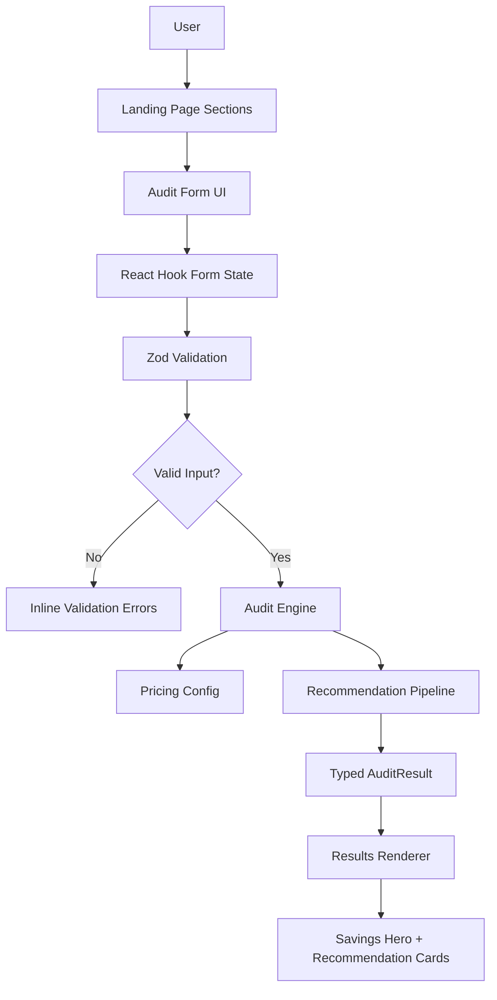

# Architecture Overview (Day 2)

## High-Level App Structure

This project is currently a frontend-first Next.js App Router application focused on landing page UX, validated audit input capture, and local recommendation generation.  
The codebase is organized around reusable UI primitives, typed domain models, and modular business logic to keep feature growth straightforward.

## Main Folders

- `app/`: routing entry points, root layout, and global styles
- `components/layout/`: cross-page layout pieces like navbar/footer
- `components/sections/`: landing page sections (hero, benefits, how-it-works, audit)
- `components/forms/`: form-specific UI composition
- `components/audit/`: savings and recommendation result rendering
- `components/ui/`: reusable, shadcn-style design system primitives
- `lib/validations/`: Zod schemas and form typing
- `lib/pricing.ts`: centralized pricing plans and tool metadata
- `lib/audit-engine.ts`: recommendation pipeline and savings calculations
- `types/`: shared domain-oriented TypeScript types

## Audit Engine Data Flow

1. User navigates landing page sections via anchor links.
2. User enters spend details into the audit form.
3. React Hook Form manages client-side form state.
4. Zod validates values and surfaces inline UI errors.
5. Valid form input is passed to `generateAuditResult(...)`.
6. Pricing and plan info are resolved from `lib/pricing.ts`.
7. Recommendation pipeline evaluates downgrade, alternative, and optimization opportunities.
8. Engine returns a typed `AuditResult` with monthly + annual savings and confidence values.
9. Results renderer components display summary and recommendation cards below the form.

## Pricing Configuration

`lib/pricing.ts` acts as the source of truth for cost assumptions:

- Tool catalog (Cursor, Copilot, Claude, ChatGPT, Gemini, Windsurf/v0)
- Plan-level monthly pricing and seat pricing
- Lightweight metadata for recommendation context
- Normalization helpers for tool aliases and plan resolution

Keeping pricing separate from recommendation logic makes rule tuning easier and keeps calculations deterministic.

## Recommendation Pipeline

`lib/audit-engine.ts` applies a small, ordered pipeline:

1. **Downgrade rules:** flags over-provisioned plans for small seat counts.
2. **Alternative rules:** for larger teams, proposes blended stack options with lower modeled spend.
3. **Optimization fallback:** suggests the most efficient available seat-level plan when appropriate.
4. **Scoring + aggregation:** computes confidence and total monthly/annual savings across recommendations.

## Component Relationships

- `components/forms/audit-form.tsx`: collects inputs and triggers engine execution
- `components/audit/results-summary.tsx`: orchestrates result section
- `components/audit/savings-hero.tsx`: highlights top-line savings
- `components/audit/tool-recommendation-card.tsx`: renders per-recommendation detail

## Why This Stack

- **Next.js 15**: App Router, strong DX, and production-ready rendering model.
- **TypeScript**: safer refactors and predictable form/schema contracts.
- **Tailwind CSS**: fast, consistent design iteration with utility-first styling.
- **shadcn/ui patterns**: composable, maintainable primitives aligned with startup-grade UI systems.

## Diagram

